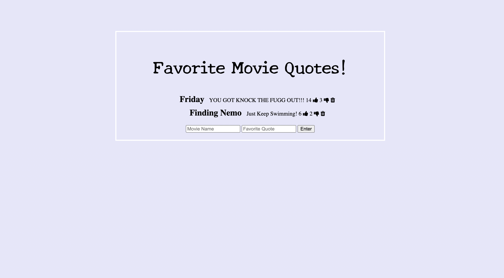

# Movie Quotes - Express

- I created an app using express where you can enter in your favorite movie quote and like or dislike everyone elses!

[Live App](https://personalexpress-moviequotes.herokuapp.com/)

## How its Made:
### Tech Used:

- HTML, CSS, JavaScript, Express, Node.js, MongoDB, HEROKU

## Lessons Learned

- I learned how to use express and node.js to get my app running server side. I also learned how to create a database using MondoDB and with that, I was able to practice using CRUD and rest api's.

## Other Projects

[To Do List express](https://express-previous-todo.herokuapp.com/)
